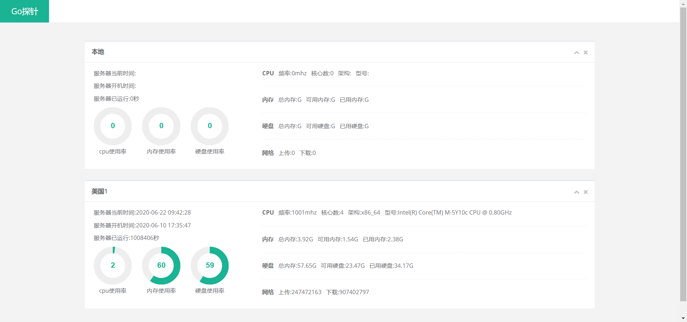
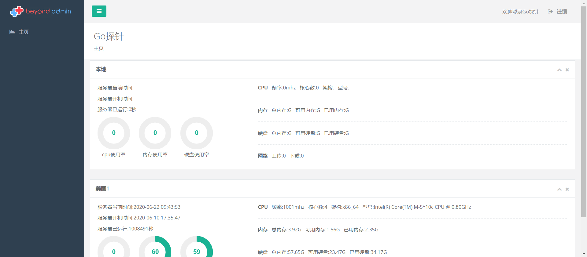
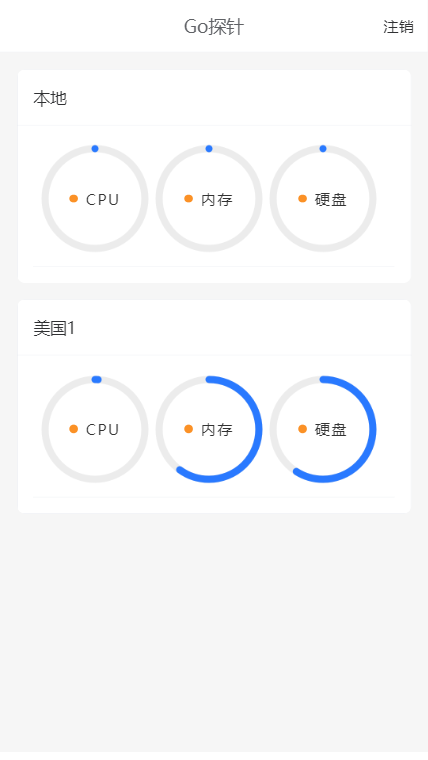

# GOtanzhen
使用GO语言写的服务器探针

# 文件说明

app源代码 为uni-app代码导入直接打包即可

探针源代码 为go写的客户端与服务端代码

编译后客户端 是编译后的linux64客户端(直接使用即可,可能需要给权限)

# 源码说明

练手之作,并且拖的时间极长,拖到最后很多代码都懒的改.

比如读取配置,其实写一个其他方法调用即可.

# 截图

网页开放访问

网页后台登录

网页后台

app登录

app界面

